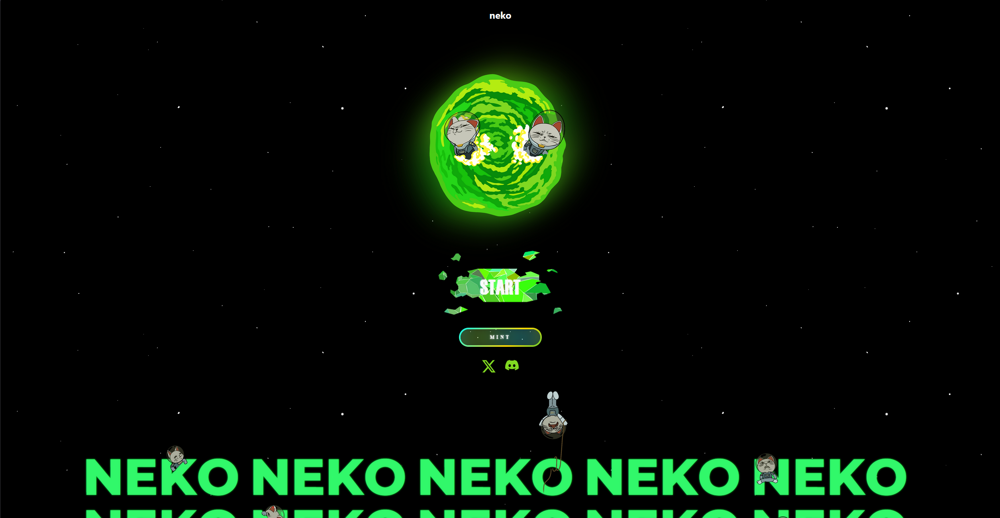
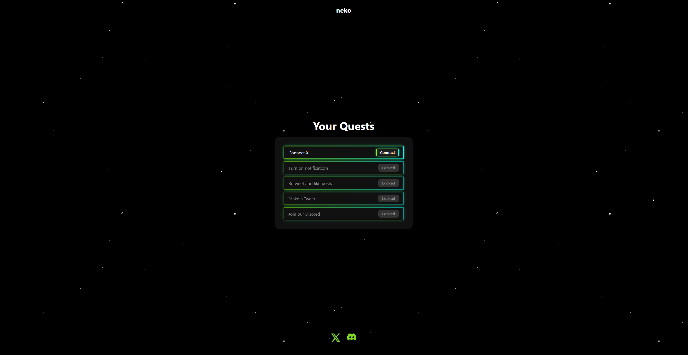

# NEKO — NFT Community Platform


> NFT community platform with a Twitter-based quest & airdrop system. Users authenticate via Twitter OAuth 2.0, complete social tasks, and register their Bitcoin Ordinals wallet for whitelist spots.

**Live demo → [your-app.vercel.app](https://your-app.vercel.app)**

---

## Screenshots

| Home | Quests |
|------|--------|
|  |  |

> _Add screenshots to the `docs/` folder after taking them locally._

---

## Features

- **Twitter OAuth 2.0** — sign in with X account, no passwords
- **Quest system** — follow, retweet, post with hashtag; verified server-side via Twitter API v2
- **Wallet registration** — save a Bitcoin Ordinals wallet address upon quest completion
- **Animated UI** — Framer Motion page transitions, magnetic cursor buttons, dust particle effects
- **Admin export** — download all registered users as `.xlsx` via ExcelJS
- **Responsive** — mobile-first, touch-aware button variants

---

## Tech Stack

| Layer | Technology |
|---|---|
| Frontend | React 19, React Router 7, Styled Components, Framer Motion |
| Backend | Node.js, Express 5, Passport.js, Twitter API v2 |
| Database | MongoDB (Mongoose) |
| Auth | Twitter OAuth 2.0 (PKCE), express-session |
| DevOps | Docker, Docker Compose, Nginx, GitHub Actions CI |
| Deploy | Vercel (client) · Render (server) · MongoDB Atlas (db) |

---

## Architecture

```
┌─────────────────────────────────────────────────┐
│                   Docker Compose                │
│                                                 │
│  ┌──────────┐    ┌──────────┐    ┌───────────┐  │
│  │  client  │───▶│  server  │───▶│   mongo   │  │
│  │  Nginx   │    │ Express  │    │  MongoDB  │  │
│  │  :80     │    │  :5000   │    │  :27017   │  │
│  └──────────┘    └──────────┘    └───────────┘  │
│       │               │                         │
│  React SPA       REST API                       │
│  /api/* proxy    Twitter OAuth 2.0              │
└─────────────────────────────────────────────────┘
```

---

## Quick Start

### Docker (recommended)

```bash
git clone https://github.com/YOUR_USERNAME/neko.git
cd neko

cp server/.env.example server/.env
# Fill in your Twitter API keys in server/.env

docker compose up --build
```

Open [http://localhost](http://localhost)

### Manual

**Requirements:** Node.js 18+, MongoDB running locally

```bash
# Terminal 1 — backend
cd server
cp .env.example .env   # fill in secrets
npm install
node index.js

# Terminal 2 — frontend
cd client
npm install
npm start
```

Open [http://localhost:3000](http://localhost:3000)

---

## Environment Variables

Copy `server/.env.example` → `server/.env` and fill in:

| Variable | Description |
|---|---|
| `MONGO_URI` | MongoDB connection string |
| `SESSION_SECRET` | Long random string for session signing |
| `TWITTER_CLIENT_ID` | Twitter Developer App — Client ID |
| `TWITTER_CLIENT_SECRET` | Twitter Developer App — Client Secret |
| `TWITTER_CALLBACK_URL` | OAuth callback URL (backend) |
| `FRONTEND_URL` | Frontend origin for CORS |

> Get Twitter credentials at [developer.twitter.com](https://developer.twitter.com)

---

## CI / CD

GitHub Actions runs on every push and pull request to `main`:

1. **Build client** — `npm ci` + `npm run build`
2. **Install server** — `npm ci --only=production`
3. **Docker build check** — builds both images with layer caching (no push)

See [.github/workflows/ci.yml](.github/workflows/ci.yml)

---

## Deployment

### Frontend → Vercel

```bash
# In Vercel dashboard set environment variable:
REACT_APP_API_URL=https://your-backend.onrender.com/api
```

Push to `main` — Vercel auto-deploys.

### Backend → Render

1. New Web Service → connect repo → Root directory: `server`
2. Build command: `npm install`
3. Start command: `node index.js`
4. Add all env vars from `.env.example`
5. Update `TWITTER_CALLBACK_URL` to your Render URL
6. Update `FRONTEND_URL` to your Vercel URL

### Database → MongoDB Atlas

1. Create free M0 cluster
2. Get connection string → paste as `MONGO_URI` in Render

---

## Project Structure

```
neko/
├── .github/workflows/ci.yml   # GitHub Actions CI
├── docker-compose.yml          # Orchestration
├── client/
│   ├── Dockerfile              # Multi-stage React → Nginx
│   ├── nginx.conf              # SPA routing + API proxy
│   └── src/
│       ├── pages/              # Home, Gallery, Quests
│       ├── components/         # Animated buttons
│       └── services/api.js     # API client
└── server/
    ├── Dockerfile              # Node.js Alpine
    ├── index.js                # Express app entry
    ├── routes/                 # auth, quests
    ├── models/User.js          # Mongoose schema
    └── services/               # Twitter OAuth 2.0
```
